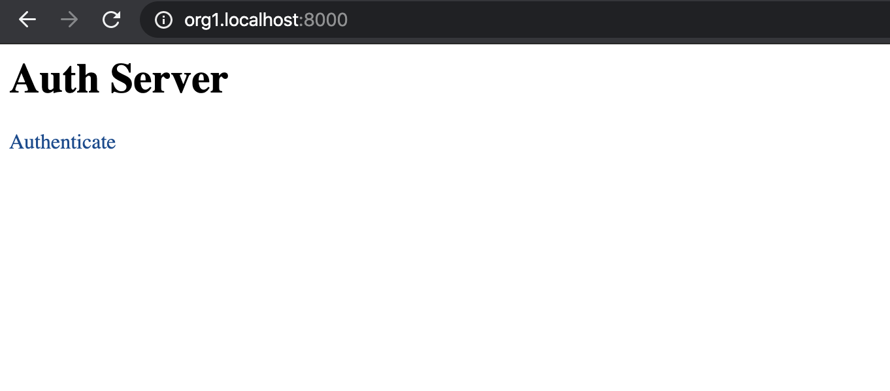
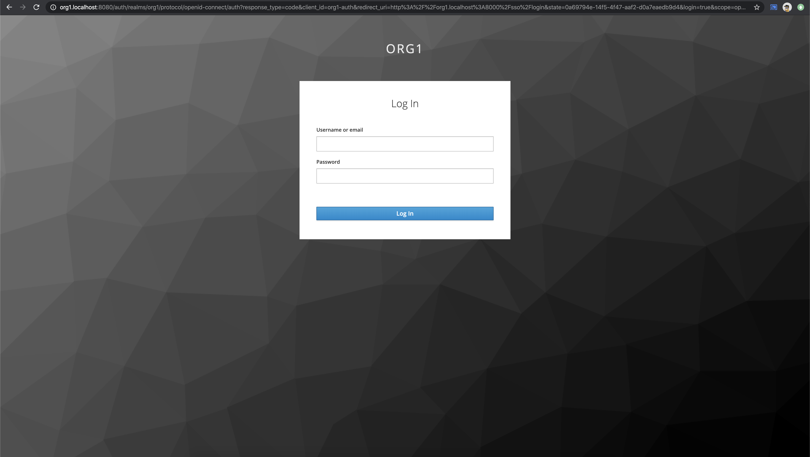
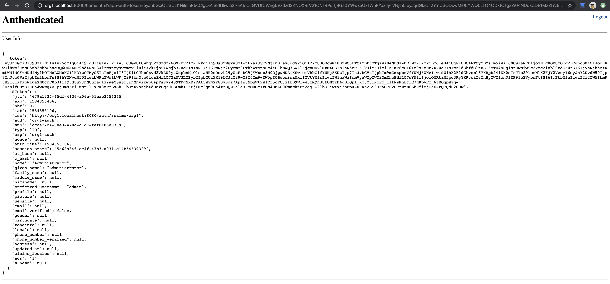
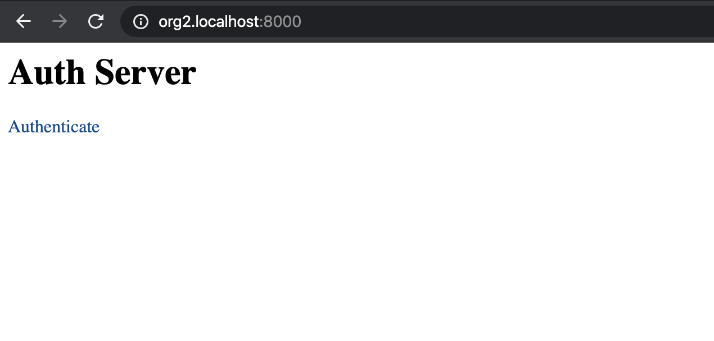
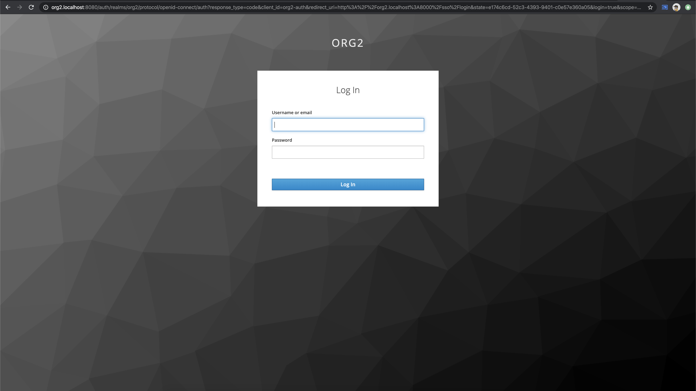
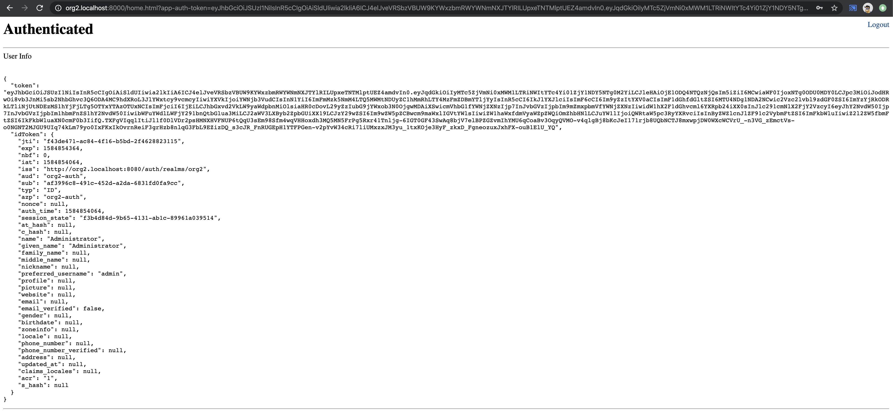

# Keycloak Multi-tenancy Implementation

This is to demonstrate the setup and usage of Keycloak for multi-tenant authentication.

For example, if you are building an app where you will be having multiple tenants, and each tenant would access the app with their respective subdomains, you would have something like following:
- Tenant 1 (named org1) will use the app with org1.yourdomain.com
- Tenant 2 (named org1) will use the app with org2.yourdomain.com

There may be same or different set of users in each of these tenents, but the user context would be different in each tenant and therefore the users have to go through each tenants authentication flow to authorize themselves to use the services of their respective tenants.

#### Prerequisites

- Docker with docker-compose
- Keycloak
- Kong
- Postgres (Optional)

#### Run

Note that in docker-compose.yml, there is an environment variable specified called `TENANTS`. 
The value specified for this is comma-separated values of tenant domain names. On start of the app, these tenant configurations are going to be setup and will be ready to be used.

Add these lines in your `/etc/hosts` file:

```bash
127.0.0.1 org1.localhost
127.0.0.1 org2.localhost
```

Start the services:

```bash
cd docker-compose
./run.sh
```

This will create a default user in each tenant. 
The user credentials are:

- Username: admin
- Password: admin

Once you've setup everything, and the services are started, you can go to your browser and access:

- http://org1.localhost - for logging into org1
- http://org1.localhost - for logging into org2

### Access org1





### Access org2



